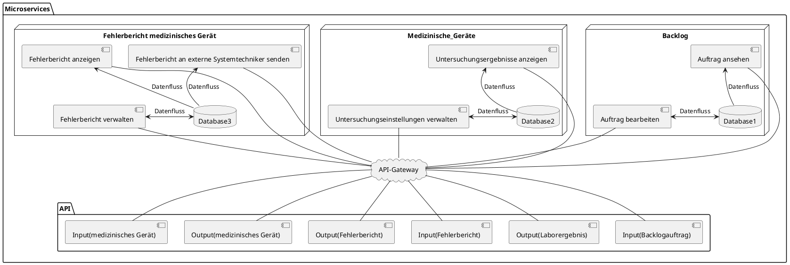
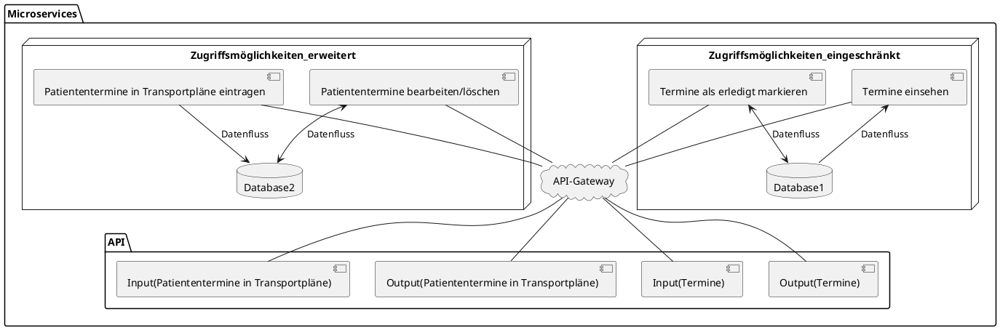
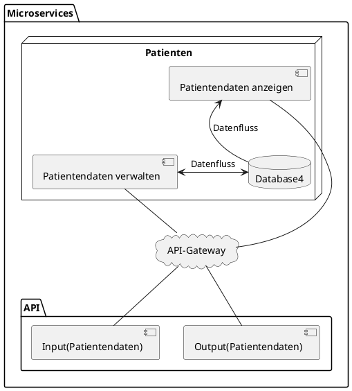
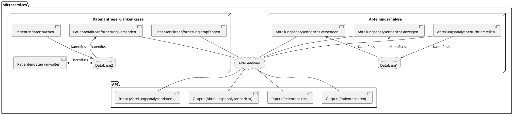
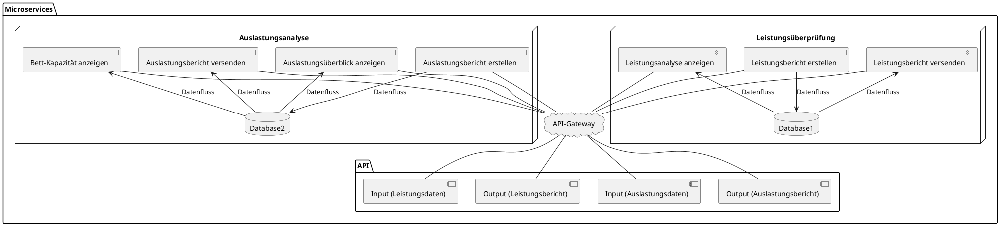

# System architecture

** Welche Systemarchitektur stehen zur Auswahl?**

** Monolithisches Architekturmodell: **
Das monolithische Architekturmodell ist ein traditioneller Ansatz zur Entwicklung von Softwareanwendungen. 
Hierbei wird das gesamte Krankenhaussystem als eine einzige, zusammenhängende Anwendung entwickelt und bereitgestellt. 
Alle Funktionen und Komponenten sind in ein einzigen Systemabbild integriert. 
Die monolithische Architektur hat eine geringere Komplexität, da alle Funktionen in einer Anwendung zusammengefasst sind.

Vorteile:
- Geringere Komplexität: Da alle Komponenten und Funktionen unter einem Dach vereint sind, haben Entwickler eine einheitliche Sicht auf das Gesamtsystem. Die Entwicklung und Bereitstellung von Anwendungen wird dadurch in vielen Fällen vereinfacht.
- Kommunikation: Da alle Teile der Anwendung innerhalb des gleichen Systems laufen, können sie ohne den Einsatz von Netzwerkprotokollen effizient kommunizieren. Dies kann zu einer geringeren internen Netzwerklatenz führen und somit die Gesamtleistung der Anwendung verbessern.

Herausforderungen:
- Skalierbarkeit: Eine der größten Herausforderungen monolithischer Architekturen ist die Skalierbarkeit. Um die Leistung zu verbessern oder mehr Benutzer zu bedienen, muss das gesamte System skaliert werden und nicht nur die Komponenten, die die größte Last tragen. Dies kann zu einer Verschwendung von Ressourcen und damit zu höheren Kosten führen.
- Wartung und Erweiterung: Da sich jede Änderung an einer Komponente auf das gesamte System auswirken kann, kann die Wartung und Erweiterung einer monolithischen Anwendung komplex und zeitaufwändig sein. Außerdem ist die Gefahr größer, dass eine kleine Änderung unerwartete Auswirkungen auf andere Teile des Systems hat.
- Code-Wiederverwendung: In einer monolithischen Architektur kann es schwierig sein, Code wiederzuverwenden oder Module zu erstellen, die in anderen Projekten verwendet werden können. Die Anwendung ist so eng miteinander verknüpft, dass es oft schwierig ist, Komponenten zu entfernen oder hinzuzufügen.

** Microservices-Architektur: **
Die Microservice-Architektur ist ein Ansatz für die Entwicklung von Softwaresystemen, bei dem die Anwendung als eine Sammlung kleiner, autonomer und modularer Dienste konzipiert wird, von denen jeder einen bestimmten Geschäftsprozess abdeckt. Jeder dieser Dienste kann unabhängig von den anderen entwickelt,
bereitgestellt, skaliert und gewartet werden. Jeder Microservice läuft in seinem eigenen Prozess und kommuniziert typischerweise mit anderen Services über definierte APIs und Protokolle, meist HTTP/REST oder asynchrone Messaging-Protokolle.

Im Kontext eines Krankenhaussystems könnte es beispielsweise separate Microservices für die Patientenaufnahme, die Diagnose und die Abrechnung geben. Jeder dieser Dienste hätte seine eigene Datenbank und Geschäftslogik und könnte unabhängig aktualisiert und skaliert werden.

Vorteile:
- Skalierbarkeit: Da jeder Dienst unabhängig skaliert werden kann, kann das System effizienter genutzt und angepasst werden. Beispielsweise könnte ein Krankenhaussystem mehr Ressourcen für den Abrechnungsdienst bereitstellen, wenn das Monatsende naht, ohne dass andere Dienste skaliert werden müssen.
- Unabhängige Entwicklung und Bereitstellung: Da jeder Dienst unabhängig ist, können Teams an verschiedenen Diensten gleichzeitig arbeiten, und Updates können ohne Beeinträchtigung der gesamten Anwendung durchgeführt werden.
- Technologievielfalt: Verschiedene Services können mit verschiedenen Technologien entwickelt werden, was die Flexibilität erhöht.
- Fehlerisolierung: Da jeder Dienst in einem eigenen Prozess abläuft, kann sich ein Fehler in einem Dienst nicht direkt auf andere Dienste auswirken. Dies kann die Ausfallsicherheit und Zuverlässigkeit des Systems erhöhen.

Herausforderungen:

- Komplexität: Die Verwaltung einer Vielzahl von Diensten kann komplex sein, und Themen wie Diensterkennung, verteilte Datenverwaltung und Kommunikation zwischen Diensten erfordern sorgfältige Planung und Koordination.
- Netzwerklatenz und -overhead: Da die Dienste miteinander kommunizieren müssen, oft über das Netzwerk, kann dies zu einer erhöhten Latenz und einem erhöhten Overhead führen.
- Datenintegrität: Da jeder Dienst seine eigene Datenbank hat, kann es eine Herausforderung sein, die Konsistenz der Daten im gesamten System zu gewährleisten.

** Schichtenarchitektur: ** 
Die Schichtenarchitektur ist ein gängiger Ansatz in der Softwareentwicklung, um die Struktur und die Komponenten einer Anwendung zu organisieren.
In einer Schichtenarchitektur ist die Anwendung in horizontale Ebenen oder "Schichten" unterteilt, wobei jede Schicht eine bestimmte Art von Aufgabe
ausführt und Dienste für die darüber liegenden Schichten bereitstellt. Jede Schicht kommuniziert nur mit der darunter- und darüberliegenden Schicht, was zur Entkopplung und Modularität der Komponenten beiträgt. Dies ermöglicht eine flexiblere Entwicklung und Wartung, da Änderungen in einer Schicht die anderen Schichten nicht direkt beeinflussen.

Vorteile:
- Trennung der Verantwortlichkeiten: Jede Schicht hat eine klare und spezifische Aufgabe. Dies erleichtert das Verständnis und die Wartung der Anwendung.
- Wartbarkeit: Änderungen in einer Schicht beeinträchtigen nicht die anderen Schichten, was die Wartung und Erweiterung erleichtert.
- Modularität: Die Schichtenarchitektur ermöglicht eine klare Trennung von Funktionen und erleichtert die Wiederverwendung von Code.
- Einfachheit der Entwicklung: Die Entwickler können sich auf eine bestimmte Schicht konzentrieren, ohne sich um die Details der anderen Schichten kümmern zu müssen.
- Wiederverwendbarkeit und Erstezbarkeit: Da jede Schicht unabhängig von den anderen ist, können Teile der Anwendung wiederverwendet oder ausgetauscht werden, ohne dass die gesamte Anwendung neu geschrieben werden muss.

Herausforderungen:
- Abstraktionskosten: Da jede Anforderung mehrere Schichten durchlaufen muss, kann dies die Gesamtleistung der Anwendung beeinflussen.
- Über-Engineering: Obwohl das Schichtenmodell die Komplexität innerhalb jeder Schicht reduziert, kann die Gesamtkomplexität der Anwendung durch die Anzahl der Schichten und die Notwendigkeit der Kommunikation zwischen den Schichten erhöht werden.

** Warum haben wir uns für Microservices entschieden **
Die Entscheidung für ein Microservices-System in einem Krankenhaus-IT-System bietet eine Reihe von Vorteilen,
die mit den spezifischen und komplexen Anforderungen eines solchen Umfelds zusammenhängen. Die Skalierbarkeit,
die durch die Möglichkeit, jede Komponente des Systems unabhängig zu skalieren, gewährleistet wird,
ermöglicht eine effiziente Ressourcennutzung für verschiedene Dienste wie Patientenaktenverwaltung,
Terminplanung und medizinische Bildgebung.
Die Unabhängigkeit der Microservices erleichtert auch die parallele Entwicklung, was die unabhängige Arbeit verschiedener Teams fördert.
Diese Unabhängigkeit trägt auch zur Fehlertoleranz bei, da der Ausfall eines Dienstes nicht notwendigerweise die anderen beeinträchtigt, was in einem Krankenhaus ein kritischer Aspekt ist.
Die technologische Flexibilität, die sich aus der Möglichkeit ergibt, für jeden Service die am besten geeignete Technologie zu wählen, bietet in einem komplexen System erhebliche Vorteile. Die schnelle Einführung neuer Funktionen und Verbesserungen wird durch die Unabhängigkeit
der Microservices in Entwicklung, Test und Bereitstellung ermöglicht.
Die Integration mit Drittanbietern wird vereinfacht, da jeder Microservice als unabhängige Schnittstelle zu externen Systemen fungieren kann. Gezielte Compliance erleichtert die Anpassung an strenge gesetzliche Vorschriften im Gesundheitswesen.
Die Isolierung von Microservices kann auch die Sicherheit verbessern, da sich eine Sicherheitsverletzung in einem Bereich des Systems nicht auf andere Bereiche ausbreitet - ein entscheidender Vorteil, wenn der Datenschutz von höchster Bedeutung ist.
Eine einfache Migration und Modernisierung wird durch die Unabhängigkeit der Microservices unterstützt, die es ermöglicht, Teile des Systems zu aktualisieren oder zu migrieren, ohne das gesamte System neu entwerfen zu müssen.
Insgesamt bieten Microservices somit ein hohes Maß an Flexibilität, Skalierbarkeit, Robustheit und Anpassbarkeit, was sie zu einer idealen Architektur für ein Krankenhaus-IT-System macht, das eine Vielzahl komplexer, interagierender Anforderungen effizient erfüllen muss.

# Microservices

**Backlog,Fehlerbericht,Medizinisches_Gerät - Lino Becht**

**Systemadministration - Jann Lucas Pischke**

```plantuml Microservices
@startuml

package "Microservices" {
  node "Systemüberwachung" {
    database "Database" as db1
    [Ressourcen überwachen] <-down- db1 : Datenfluss
    [Benachrichtigungen senden] <-down- db1 : Datenfluss
  }
  node "Benutzerverwaltung" {
    database "Datenbank" as db2
    [Konroverwaltung] <-down-> db2 : Datenfluss
    [Passwortverwaltung] <-down-> db2 : Datenfluss
    [Richtlinienverwaltung] <-down-> db2 : Datenfluss
    [Rechteverwaltung] <-down-> db2 : Datenfluss
  }
  node "Konfigurationsdatenverwaltung" {
    database "Datenbank" as db3
    [Konfigurationsdaten bearbeiten] <-down-> db3 : Datenfluss
    [Konfigurationsdaten einsehen] <-down- db3 : Datenfluss
  }
  node "Dokumentationsverwaltung" {
    database "Datenbank" as db4
    [Dokumente bearbeiten] <-down-> db4 : Datenfluss
    [Dokumente einsehen]  <-down- db4 : Datenfluss
  }
  cloud "API-Gateway"

  package "API" {
    [Input(Systemüberwachung)]
    [Output(Systemüberwachung)]
    [Input(Benutzerverwaltung)]
    [Output(Benutzerverwaltung)]
    [Input(Konfigurationsdatenverwaltung)]
    [Output(Konfigurationsdatenverwaltung)]
    [Input(Dokumentationsverwaltung)]
    [Output(Dokumentationsverwaltung)]
  }

  [Ressourcen überwachen]  -down- "API-Gateway" 
  [Benachrichtigungen senden] -down- "API-Gateway"
  [Konroverwaltung] -down- "API-Gateway"
  [Passwortverwaltung] -down- "API-Gateway"
  [Richtlinienverwaltung] -down- "API-Gateway"
  [Rechteverwaltung] -down- "API-Gateway"
  [Konfigurationsdaten bearbeiten] -down- "API-Gateway"
  [Dokumente bearbeiten] -down- "API-Gateway"

  "API-Gateway" -- [Input(Systemüberwachung)]
  "API-Gateway" -- [Output(Systemüberwachung)]
  "API-Gateway" -- [Input(Benutzerverwaltung)]
  "API-Gateway" -- [Output(Benutzerverwaltung)]
  "API-Gateway" -- [Input(Konfigurationsdatenverwaltung)]
  "API-Gateway" -- [Output(Konfigurationsdatenverwaltung)]
  "API-Gateway" -- [Input(Dokumentationsverwaltung)]
  "API-Gateway" -- [Output(Dokumentationsverwaltung)]

}

@enduml
```

**Patiententransportdienst - Helen Laible**

**Patienten - Antonia Geschke**

**Abteilungsanalyse, Datenanfrage Krankenkasse - Duc Duong Nguyen**

**Leistungsüberprüfung, Auslastungsanalyse - Duc Duong Nguyen**

**Gesamte Architektur**

```plantuml Microservices
@startuml
left to right direction

package "Microservices" {

'-----------Lino-----------
  node "Backlog" {
    [Auftrag bearbeiten]
    [Auftrag ansehen]

    database "Database1"{
      [Auftrag ansehen] <-- Database1 : Datenfluss
      [Auftrag bearbeiten] <-> Database1: Datenfluss
    }
  }

  node "Medizinische Geräte" {
    [Untersuchungsergebnisse anzeigen]
    [Untersuchungseinstellungen verwalten]

    database "Database2"{
      [Untersuchungsergebnisse anzeigen] <-- Database2 : Datenfluss
      [Untersuchungseinstellungen verwalten] <-> Database2 : Datenfluss
    }
  }

  node "Fehlerbericht medizinisches Gerät"{
    [Fehlerbericht verwalten]
    [Fehlerbericht anzeigen]
    [Fehlerbericht an externe Systemtechniker senden]

    database "Database3"{
      [Fehlerbericht anzeigen] <-- Database3 : Datenfluss
      [Fehlerbericht an externe Systemtechniker senden] <-- Database3 : Datenfluss
      [Fehlerbericht verwalten] <-> Database3 : Datenfluss
    }
  }

'-----------Helen-----------
   node "Zugriffsmöglichkeiten_eingeschränkt" {
    [Termine als erledigt markieren]
    [Termine einsehen]
    database "Database4"{
      [Termine einsehen] <-- Database4 : Datenfluss
      [Termine als erledigt markieren] <--> Database4 : Datenfluss
    }
  }

  node "Zugriffsmöglichkeiten_erweitert"{
    [Patiententermine in Transportpläne eintragen]
    [Patiententermine bearbeiten/löschen]
    database "Database5"{
      [Patiententermine in Transportpläne eintragen] --> Database5 : Datenfluss
      [Patiententermine bearbeiten/löschen] <--> Database5 : Datenfluss
    }
  }

'-----------Antonia-----------
  node "Patienten" {
    [Patientendaten anzeigen]
    [Patientendaten verwalten] as patienten_antonia

    database "Database6"{
      [Patientendaten anzeigen] <-- Database6 : Datenfluss
      patienten_antonia <-> Database6 : Datenfluss
    }
  }

'-----------Duong-----------
node "Abteilungsanalyse" {
    [Abteilungsanalysenbericht anzeigen] 
    [Abteilungsanalysbenricht erstellen] 
    [Abteilungsanalysenbericht versenden] 
   
    database "Database7"{
      [Abteilungsanalysenbericht anzeigen] <-- Database7 : Datenfluss
      [Abteilungsanalysbenricht erstellen] --> Database7 : Datenfluss
      [Abteilungsanalysenbericht versenden] <-- Database7 : Datenfluss
    }
  }

 node "Datenanfrage Krankenkasse"{
    [Patientenakteanforderung empfangen] 
    [Patientenakteanforderung versenden]
    [Patientendaten suchen]
    [Patientendaten verwalten] as patienten_doung

    database "Database8"{
      patienten_doung <-> Database8 : Datenfluss
      [Patientendaten suchen] --> Database8 : Datenfluss
      [Patientenakteanforderung versenden] <-- Database8 : Datenfluss
    }
  }
   node "Leistungsüberprüfung" {
    [Leistungsanalyse anzeigen] 
    [Leistungsbericht erstellen] 
    [Leistungsbericht versenden] 

    database "Database9"{
      [Leistungsbericht erstellen] --> Database9 : Datenfluss
      [Leistungsanalyse anzeigen] <-- Database9 : Datenfluss
      [Leistungsbericht versenden] <-- Database9 : Datenfluss
    }
  }

   node "Auslastungsanalyse"{
    [Auslastungsüberblick anzeigen] 
    [Auslastungsbericht erstellen] 
    [Auslastungsbericht versenden] 
    [Bett-Kapazität anzeigen] 

    database "Database10"{
      [Auslastungsüberblick anzeigen] <-- Database10 : Datenfluss 
      [Auslastungsbericht erstellen] --> Database10 : Datenfluss
      [Bett-Kapazität anzeigen] <-- Database10 : Datenfluss
      [Auslastungsbericht versenden] <-- Database10 : Datenfluss
    }
  }
'-----------Jann-----------
  node "Systemüberwachung" {
    database "Datenbank11" as db11
    [Ressourcen überwachen] <-down- db11 : Datenfluss
    [Benachrichtigungen senden] <-down- db11 : Datenfluss
  }
  node "Benutzerverwaltung" {
    database "Datenbank12" as db12
    [Konroverwaltung] <-down-> db12 : Datenfluss
    [Passwortverwaltung] <-down-> db12 : Datenfluss
    [Richtlinienverwaltung] <-down-> db12 : Datenfluss
    [Rechteverwaltung] <-down-> db12 : Datenfluss
  }
  node "Konfigurationsdatenverwaltung" {
    database "Datenbank13" as db13
    [Konfigurationsdaten bearbeiten] <-down-> db13 : Datenfluss
    [Konfigurationsdaten einsehen] <-down- db13 : Datenfluss
  }
  node "Dokumentationsverwaltung" {
    database "Datenbank14" as db14
    [Dokumente bearbeiten] <-down-> db14 : Datenfluss
    [Dokumente einsehen]  <-down- db14 : Datenfluss
  }


  cloud "API-Gateway"

  package "API"{
'-----------Lino-----------
    [Input(medizinisches Gerät)]
    [Output(medizinisches Gerät)]
    [Output(Fehlerbericht)]
    [Input(Fehlerbericht)]
    [Output(Laborergebnis)]
    [Input(Backlogauftrag)]

'-----------Helen-----------
    [Input(Patiententermine in Transportpläne)]
    [Output(Patiententermine in Transportpläne)]
    [Input(Termine)]
    [Output(Termine)]

'-----------Antonia-----------
    [Input(Patientendaten)]
    [Output(Patientendaten)]

'-----------Duong-----------
  [Input (Abteilungsanalysendaten)]
  [Output (Abteilungsanalysenbericht)]
  [Input (Patientenakte)]
  [Output (Patientenakten)]   
  [Input (Leistungsdaten)]
  [Output (Leistungsbericht)]
  [Input (Auslastungsdaten)]
  [Output (Auslastungsbericht)]

  '-----------Jann-----------
  [Input(Systemüberwachung)]
  [Output(Systemüberwachung)]
  [Input(Benutzerverwaltung)]
  [Output(Benutzerverwaltung)]
  [Input(Konfigurationsdatenverwaltung)]
  [Output(Konfigurationsdatenverwaltung)]
  [Input(Dokumentationsverwaltung)]
  [Output(Dokumentationsverwaltung)]
  }
}

'-----------Lino-----------
[Untersuchungsergebnisse anzeigen] -up- "API-Gateway"
[Untersuchungseinstellungen verwalten] -up- "API-Gateway"
[Fehlerbericht anzeigen] -up- "API-Gateway"
[Fehlerbericht verwalten] -up- "API-Gateway"
[Fehlerbericht an externe Systemtechniker senden] -up- "API-Gateway"
[Auftrag bearbeiten] -up- "API-Gateway"
[Auftrag ansehen] -up- "API-Gateway"

"API-Gateway" -- [Input(medizinisches Gerät)]
"API-Gateway" -- [Output(medizinisches Gerät)]
"API-Gateway" -- [Output(Fehlerbericht)]
"API-Gateway" -- [Input(Fehlerbericht)]
"API-Gateway" -- [Output(Laborergebnis)]
"API-Gateway" -- [Input(Backlogauftrag)]

'-----------Helen-----------
[Termine einsehen] -up- "API-Gateway"
[Termine als erledigt markieren] -up- "API-Gateway"
[Patiententermine in Transportpläne eintragen] -up- "API-Gateway"
[Patiententermine bearbeiten/löschen] -up- "API-Gateway"

"API-Gateway" -- [Input(Patiententermine in Transportpläne)]
"API-Gateway" -- [Input(Termine)]
"API-Gateway" -- [Output(Termine)]
"API-Gateway" -- [Output(Patiententermine in Transportpläne)]

'-----------Antonia-----------
[Patientendaten anzeigen] -up- "API-Gateway"
[Patientendaten verwalten] -up- "API-Gateway"

"API-Gateway" -- [Input(Patientendaten)]
"API-Gateway" -- [Output(Patientendaten)]

'-----------Duong-----------
[Abteilungsanalysbenricht erstellen] -up- "API-Gateway"
[Abteilungsanalysenbericht anzeigen] -up- "API-Gateway"
[Abteilungsanalysenbericht versenden] -up- "API-Gateway"
[Patientenakteanforderung empfangen] -up- "API-Gateway"
[Patientenakteanforderung versenden] -up- "API-Gateway"
[Leistungsbericht erstellen] -up- "API-Gateway"
[Leistungsanalyse anzeigen] -up- "API-Gateway"
[Leistungsbericht versenden] -up- "API-Gateway"
[Bett-Kapazität anzeigen] -up- "API-Gateway"
[Auslastungsbericht erstellen] -up- "API-Gateway"
[Auslastungsüberblick anzeigen] -up- "API-Gateway"
[Auslastungsbericht versenden] -up- "API-Gateway"

"API-Gateway" -- [Input (Abteilungsanalysendaten)]
"API-Gateway" -- [Output (Abteilungsanalysenbericht)]
"API-Gateway" -- [Input (Patientenakte)]
"API-Gateway" -- [Output (Patientenakten)]
"API-Gateway" -- [Input (Leistungsdaten)]
"API-Gateway" -- [Output (Leistungsbericht)]
"API-Gateway" -- [Input (Auslastungsdaten)]
"API-Gateway" -- [Output (Auslastungsbericht)]

'-----------Jann-----------

[Ressourcen überwachen]  -up- "API-Gateway" 
[Benachrichtigungen senden] -up- "API-Gateway"
[Konroverwaltung] -up- "API-Gateway"
[Passwortverwaltung] -up- "API-Gateway"
[Richtlinienverwaltung] -up- "API-Gateway"
[Rechteverwaltung] -up- "API-Gateway"
[Konfigurationsdaten bearbeiten] -up- "API-Gateway"
[Dokumente bearbeiten] -up- "API-Gateway"

"API-Gateway" -- [Input(Systemüberwachung)]
"API-Gateway" -- [Output(Systemüberwachung)]
"API-Gateway" -- [Input(Benutzerverwaltung)]
"API-Gateway" -- [Output(Benutzerverwaltung)]
"API-Gateway" -- [Input(Konfigurationsdatenverwaltung)]
"API-Gateway" -- [Output(Konfigurationsdatenverwaltung)]
"API-Gateway" -- [Input(Dokumentationsverwaltung)]
"API-Gateway" -- [Output(Dokumentationsverwaltung)]

@enduml
```

